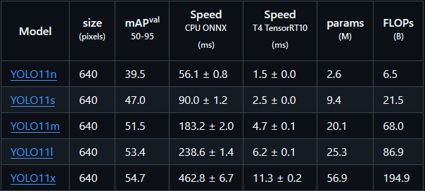
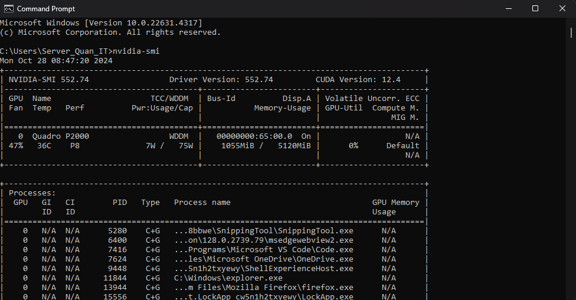
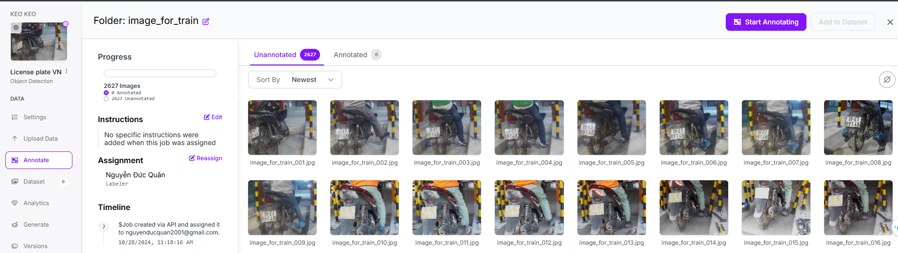
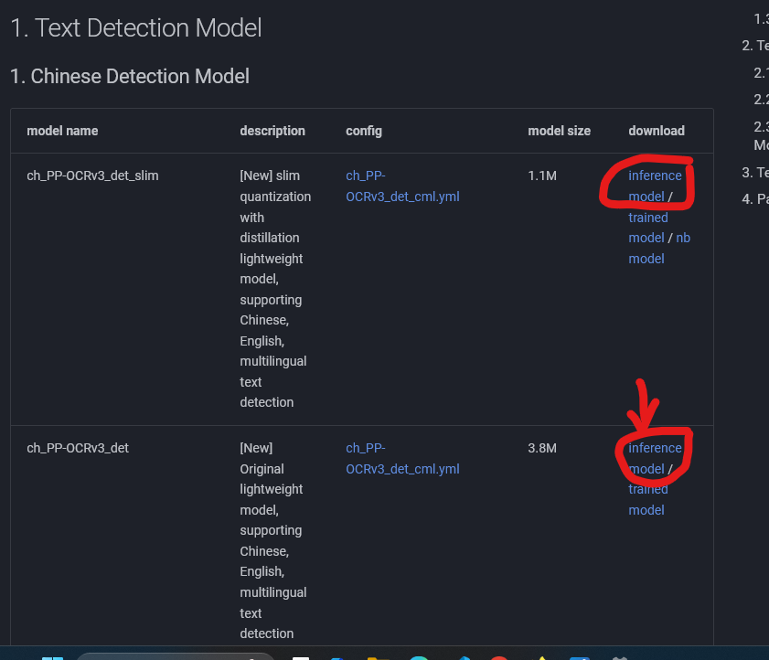

# Fast_API_server

# Hướng dẫn cách tạo API với FastAPI

# Mục lục

[I. FastAPI](#i-fastapi)
- [1. Cài đặt FastAPI](#1-cài-đặt-fastapi)
- [2. Khởi chạy FastAPI](#2-khởi-chạy-fastapi)

[II. Cách sử dụng](#ii-cách-sử-dụng)
- [1. Kết nối với CSDL (SQL Server)](#1-Kết-nối-với-CSDL-SQL-Server)
  - [1. Tạo chuỗi kết nối](#1-tạo-chuỗi-kết-nối)
  - [2. Tạo bảng dữ liệu](#2-tạo-bảng-dữ-liệu)
  - [3. Thêm sửa xóa dữ liệu trong CSDL ](#3-thêm-sửa-xóa-dữ-liệu-trong-CSDL)

- [2. Mã hóa mật khẩu](#2-mã-hóa-mật-khẩu)
  - [1. Mã hóa và giải mã](#1-mã-hóa-và-giải-mã)
  - [2. Sử dụng](#2-sử-dụng)

- [3. Token](#3-token)
  - [1. Tạo token](#1-tạo-token)
  - [2. Yêu cầu xác thực khi gọi api](#2-yêu-cầu-xác-thực-khi-gọi-api)

- [4. Triển khai API với model AI](#4-triển-khai-api-với-model-ai)
    - [1. Yolo model](#1-yolo-model)
    - [2. PaddleOCR](#2-paddleocr)
    - [3. Kết hợp AI vào FastAPI](#3-kết-hợp-ai-vào-fastapi)

[III. Deploy FastAPI với Docker](#iii-deploy-fastapi-với-docker)
    - [1. Tải Docker Desktop](#1-tải-docker-desktop)
    - [2. Cài đặt file để chạy](#2-cài-đặt-file-để-chạy)

[IV . Video hướng dẫn](#iv-video-hướng-dẫn)

# I. FastAPI

## 1. Cài đặt FastAPI

Cài đặt `FastAPI` thông qua lệnh `pip` hoặc trực tiếp từ mã nguồn mở, xem chi tiết tại trang chủ [FastAPI](https://fastapi.tiangolo.com/):  

```python
pip install "fastapi[standard]"
```

## 2. Khởi chạy FastAPI

Để chạy `FastAPI` ta có thể sử dụng 2 câu lệnh thường xuyên như sau:  

```python
fastapi dev main.py
```


Câu lệnh này sẽ chạy `FastAPI` trên môi trường `Developer`, có nghĩa là môi trường test, khi bạn đang chạy `server (là khởi chạy fastapi)` và bạn thay đổi một số đoạn `code`, chỉnh sửa thêm một số file thì khi bạn lưu lại code nó sẽ tự động khởi động lại server, không cần ta phải chạy lại câu lệnh `fastapi dev main.py`.  

Và khi chạy lệnh này thì bạn chỉ có thể truy cập vào các địa chỉ có sẵn từ máy của bạn như:  
`http://127.0.0.1:8000/docs ` để xem toàn bộ api  
`http://127.0.0.1:8000/apixxx` truy cập api bạn tạo  

Và chỉ có duy nhất máy chủ có thể truy cập, các máy khác chưa thể truy cập được api này, vì vậy câu lệnh này chỉ chạy trên môi trường `dev`  

Cách thứ 2 ta có thể khởi động server là:  
```python
fastapi run main.py
```


Câu lệnh này sẽ lấy máy đang chạy làm máy chủ, và các máy tính khác trong cùng 1 dải mạng đều có thể truy cập api mà bạn tạo ra. Khi đó các máy khác sẽ truy cập được api của bạn thông qua địa chỉ:  

`http://IP:Port/apixxx`  
Trong đó `IP` sẽ là địa chỉ IP của máy tính đang làm server, port sẽ là: `8000` nếu bạn không cấu hình riêng, `apixxx` sẽ là địa chỉ api của bạn. Ví dụ:  
Để lấy địa chỉ ip của server thì bạn chạy lệnh sau trên CMD:
```
ipconfig
```


Ta có thể thấy được hai địa chỉ ip của máy tính như sau. Với `Ethernet: 192.168.0.100`, `Wifi: 172.31.99.131`, port thì mình không chỉnh sửa gì cả nên nó sẽ là `8000`, `apixxx: image/create_new_image`  
Như vậy ta có đường dẫn api cụ thể cho máy khác như sau:  
`http://192.168.0.100:8000/file/list_file_in_folder/` sẽ dành cho các máy tính kết nối với nhau thông qua `ethernet`.  

`http://172.31.99.131:8000/file/list_file_in_folder/` sẽ dành cho các máy tính kết nối cùng 1 mạng `wifi`.  


# II. Cách sử dụng

## 1. Kết nối với CSDL (SQL Server)

### 1. Tạo chuỗi kết nối

Để kết nối `FastAPI` với `SQL Server` thì ta cần thư viện: `sqlalchemy`, `pyodbc` và `driver ODBC`.  


Để cài đặt 2 thư viện trên ta sử dụng câu lệnh `pip`:  
```python
pip install SQLAlchemy
pip install pyodbc
```
Còn `drvier ODBC` ta lên trang chủ tải [Tại đây](https://learn.microsoft.com/en-us/sql/connect/odbc/download-odbc-driver-for-sql-server)  


Nhớ lưu ý phiên bản driver, như tôi đang sử dụng là `ODBC driver 18`.  

Để đảm bảo có thể kết nối đến được `SQL Server` thì trước tiên bạn phải kết nối được với nó bằng `tài khoản` bất kỳ, có thể là `sa` hay tên khác. Ví dụ như hình ảnh bên dưới.  


Sau khi đảm bảo được có thể kết nối tới `SQL Server` bằng tài khoản thì ta tạo cấu trúc kết nối bằng `Python` như sau:  

```python
# Lấy địa chỉ IP của máy chủ bằng socket
MY_HOSTNAME = socket.gethostname()
MY_IP_ADDR = socket.gethostbyname(MY_HOSTNAME)

# Cấu trúc chuỗi kết nối đến SQL Server
# pip install pyodbc
connection_url = URL.create(
    "mssql+pyodbc",
    username="sa", # Tên đăng nhập 
    password="123456789", # mật khẩu đăng nhập
    host=MY_IP_ADDR, #Địa chỉ IP của máy tính lấy được
    port=1433, # cổng kết nối khi mở kết nối SQL server, xem them wor video youtube của bản thân
    database="Smart_Parking_Server", # Tên của database cần truy cập
    query={
        "driver": "ODBC Driver 18 for SQL Server", # Phiên bản driver của ODBC đã tải về từ microsoft
        "TrustServerCertificate": "yes"  
    },
)

# Kết nối đến SQL Server
engine = create_engine(
    connection_url
)
```
Để biết thêm cách cho phép tài khoản `sa` có thể truy cập từ xa, hay remote SQL Server thì xem thêm tại [youtube cách remote SQL Server](https://youtu.be/NJYRgKpKePQ?si=JvDe-urxTRwOpm-Q)
Xem ví dụ cụ thể [tại đây](db/database.py)  

### 2. Tạo bảng dữ liệu  

Để tạo một bảng trong CSDL thì ta cần sử dụng lớp cha `Base = declarative_base()`, sau đó các bảng sẽ kế thừa lớp `Base` này. Trước tiên ta cần phải có cấu trúc của bảng mà ta cần tạo. Sau đó định nghĩa bảng đấy như sau:  

```python
class DbEmployee(Base):

    """
    Định nghĩa bảng nhân viên trong CSDL  
    - **tablename** là tên của bảng  
    - **id_code_employee*: Mã nhân viên  
    - **id_card**: Mã code phía sau thẻ nhân viên  
    - **username**: Họ tên nhân viên  
    - **avatar**: Ảnh đại diện của nhân viên
    - **vehicle**: Phương tiện di chuyển  
    - **email**: Email của nhân viên  
    - **phone_number**: SĐT của nhân viên  
    - **section**: Bộ phận của nhân viên  
    - **permission**: Quyền hạn  
    - **other**: các cột được bổ sung thông tin sau này  
    Bảng này sẽ được tạo nếu nó chưa tồn tại trong CSDL
    """
    __tablename__ = "employee"
    id_code_employee = Column(Integer, primary_key=True, unique=True)
    id_card = Column(Integer)
    id_vehicle = Column(Integer)
    username = Column(Unicode(100)) # Sử dụng kiểu Nvarchar
    avatar = Column(Unicode(100))
    email = Column(String(255), unique=True)
    phone_number = Column(String)
    section = Column(String)
    permission = Column(String)

    other1 = Column(String)
    other2 = Column(String)
    other3 = Column(String)
    other4 = Column(String)
    other5 = Column(String)
```
Chúng ta muốn tạo những bảng nào trong CSDL thì cần định nghĩa tất cả bảng. Một số kiểu dữ liệu nổi bật là:  

```python
from sqlalchemy import Unicode
from sqlalchemy import Column, Integer, String, DateTime
```
`Integer`: Số nguyên  
`String`: Chuỗi, thêm (255) sẽ là số ký tự tối đa  
`Unicode`: Chuỗi nhưng có dấu  
`DateTime`: ngày giờ  


Xem ví dụ cụ thể [tại đây](db/model.py)  

### 3. Thêm sửa xóa dữ liệu trong CSDL  

Sau khi có bảng dữ liệu trong `SQL Server` thì ta sẽ tiến hành `Thao tác` với những trường dữ liệu này. Đầu tiên ta cần định nghĩa các lược đồ của bảng dữ liệu trong `SQL Server`. Ví dụ với bảng `employee` mà tôi đã tạo trước đó. Để có thể thao tác với dữ liệu trong `SQL Server` thì ta cần lớp `BaseModel` từ thư viện `pydantic`.  

```python
class EmployeeBase(BaseModel):
    """
    Class này chứa thông tin cần được cung cấp để tạo một nhân viên mới
    - **id code**: Mã nhân viên  
    - **id card**: Mã thẻ từ của nhân viên  
    - **username**: Họ tên nhân viên  
    - **email**: Email của nhân viên  
    - **phone_number**: SĐT của nhân viên  
    - **section**: Bộ phận của nhân viên  
    - **permission**: Quyền hạn  
    - **other**: các cột được bổ sung thông tin sau này, khi nào thêm thông tin thì thêm vào  
    """
    id_code_employee: int
    id_card: int
    id_vehicle: int
    username: str
    email: str
    phone_number: str
    section: str
    permission: str
```
Class này sẽ chứa những thông tin mà ta cần người dùng cung cấp cho chúng ta, bạn có thể nhận thấy là nó đang thiếu 2 mục `avatar` và `other`.  

> Avatar là đường dẫn hình ảnh khi người dùng tải lên, việc người dùng vừa tải hình ảnh lên, vừa cung cấp các thông tin dạng json vào cùng 1 lúc sẽ gây ra lỗi khi gọi api. Vì vậy class này chỉ chứa các thông tin của người dùng, còn hình ảnh thì sau khi người dùng đã tạo hết thông tin thì sẽ có 1 api cho người dùng tải hình ảnh lên riêng. Vì vậy ở đây sẽ không có mục avatar.  
> Tương tự với other thì để dành cho sau này nên bây giờ nó chưa cần người dùng cung cấp thông tin nên sẽ không có vào.

Sau khi có thông tin từ người dùng, ta cũng cần phản hồi lại cho người dùng 1 thông tin. Ví dụ khi bạn cung cấp thông tin để tạo tài khoản, tạo xong thì sẽ có một thông báo trả về với nội dung: `Bạn đã tạo thành công tài khoản với tên người dùng: xxx`. Người dùng cung cấp rất nhiều thông tin, nhưng chúng ta trả về đơn giản chỉ là những thông tin cần thiết. Không nhất thiết phải trả về đầy đủ thông tin và những thông tin có tính cá nhân `(email, sđt, mật khẩu)` thì tuyệt đối không trả về bừa bãi.  
Vì vậy ta cũng tạo một class để hiển thị những thông tin trả về, và sau này chỉ cần gọi class này trong phản hồi thì nó sẽ tự động trả về những thông tin mà mình đã chỉ định:  

```python
class EmployeeDisplay(BaseModel):
    """
    Trả về thông tin người dùng theo ý muốn, không trả về những thông tin quan trọng như password đã hash
    Lưu ý tên của các trường thông tin trả về phải giống nhau, nếu không gặp lỗi
    - **id_code_employee**: Mã nhân viên  
    - **username**: Họ tên nhân viên  
    - **avatar**: Ảnh đại diện của nhân viên
    - **id_vehicle**: Phương tiện di chuyển  
    - **email**: Email của nhân viên  
    - **section**: Bộ phận của nhân viên  
    -  **Config**: cho phép tự động chuyển đổi dữ liệu type: Database quay trở về kiểu mà ta đã khai báo (str)
    """
    id_code_employee: int
    username: str
    avatar: str
    email:str
    section: str
    id_vehicle: int
    class Config():
        from_attributes  = True
```
##
Ta cần khai báo `Config` để khi ta lấy thông tin từ `SQL Server` trả về dưới dạng `string`, `int` không gặp lỗi. Nếu không sẽ gặp xung đột khi cố gắng chuyển đổi kiểu dữ liệu của `Database` sang kiểu dữ liệu `python`.  
##

Tương tự với các bảng còn lại, ta cần người dùng cung cấp thông tin gì thì sử dụng `class tableBase`, và sẽ hiển thị những thông tin gì khi có người gọi api thì sử dụng `class tableDisplay`.  

Xem ví dụ cụ thể [tại đây](schemas/schemas.py)  

##  
Tất cả các công việc liên quan với `Database` trong `FastAPI` thì ta sẽ sử dụng thư viện `sqlachemy` để thao tác.  
Với việc thêm 1 trường dữ liệu vào bảng trong `SQL Server` ta làm như sau:  

```python
def create_employee(db: Session, request: EmployeeBase, avatar_path: str = "Not upload"):
    """
    Tạo thông tin nhân viên mới vào cơ sở dữ liệu  
    Các thông tin yêu cầu người dùng cung cấp phải đầy đủ như đã khai báo ở `DbEmployee`
    
    """
    
    new_employee = DbEmployee(
        id_code_employee = request.id_code_employee,
        id_card = request.id_card,
        id_vehicle = request.id_vehicle,
        username = request.username,
        avatar = avatar_path,
        email = request.email,
        phone_number=request.phone_number,
        section = request.section,
        permission = request.permission,
        other1 = "Not use",
        other2 = "Not use",
        other3 = "Not use",
        other4 = "Not use",
        other5 = "Not use",
    )

    try:
        db.add(new_employee)
        db.commit()
        db.refresh(new_employee)
    except exc.SQLAlchemyError as e:
        db.rollback()
        raise HTTPException(
            status_code= status.HTTP_400_BAD_REQUEST,
            detail= f"Thêm nhân viên mới không thành công, lỗi: {e}"
        )
    return new_employee
```

Khi ta tạo một đối tượng `new_employee` thì ta cần phải cung cấp đầy đủ thông tin mà bảng đó cần. Với bảng `employee` thì ta cần các trường: `id_code_employee`, `id_card`, `id_vehicle`, `username`, `avatar`, `email`, `phone_number`, `section`, `permission`, `other1-5`. Vì vậy đối tượng `new_employee` sẽ phải đầy đủ những thông tin đó.  
Các thông tin này sẽ được lấy từ biến `request` là đối tượng thuộc class `EmployeeBase`. Hai trường `avatar` và `other` mình điền là các chuỗi string mặc định. Bởi vì trong class `EmployeeBase` mình không khai báo 2 trường này nên `request` không có 2 thuộc tính này để truy cập.  
Ta có thể thêm thời gian bằng thư viện `datetime` như sau: `time_in = datetime.datetime.now()`  
Sau khi tạo một đối tượng mới cho bảng `employee` thì ta sẽ thêm nó vào DB thông qua `db:session` là một phiên kết nối tới `SQL Server` bằng câu lệnh:  

```python
try:
        db.add(new_employee)
        db.commit()
        db.refresh(new_employee)
except exc.SQLAlchemyError as e:
    db.rollback()
    print(e)

    raise HTTPException(
        status_code= status.HTTP_400_BAD_REQUEST,
        detail= "Thêm nhân viên mới không thành công"
    )
```

Sau khi sử dụng câu lệnh `add` thì phải `commit` để lúc đấy mới chính thức đưa dữ liệu lên DB, và chúng ta `refresf(new_employy)` để cập nhật lại các giá trị index. Việc thêm sửa xóa dữ liệu ở DB có nguy cơ lỗi rất cao nên chúng ta phải sử dụng `try-except` để đảm bảo nếu trong quá trình ghi dữ liệu lỗi thì có thể `rollback` lại để quay trở lại trước khi xảy ra lỗi. Và sau đó dưa ra một `Exception` kèm theo `mã code lỗi` và chi tiết lỗi. Như vậy khi gọi api mà ta nhận mã code `200` là thêm dữ liệu thành công, được mã lỗi `400` là ta biết được rằng trong quá trình thêm dữ liệu bị lỗi và đã `rollback`, còn các mã lỗi khác thì có thể gặp vấn đề với kết nối với server. Việc này giúp ta nắm rõ hơn các trường hợp xảy ra khi gọi api.  

Sau khi có hàm tạo nhân viên thì ta sẽ tiến hành tạo một api gọi đến hàm này.  

```python
from fastapi import APIRouter, Depends
from sqlalchemy.orm.session import Session
from schemas.schemas import EmployeeDisplay, EmployeeBase
from db.database import get_db
from db import db_employee

router = APIRouter(
    prefix="/employee",
    tags=["employee"]
)

# Tạo thông tin nhân viên vào CSDL
@router.post("/create_employee",response_model= EmployeeDisplay)
def create_user(request: EmployeeBase, db: Session = Depends(get_db)): # avatar: UploadFile = File(...): không thể vừa tải lên Json vừa uploadfile
    """
    Tạo thông tin nhân viên vào CSDL, việc tạo thông tin và cập nhật hình ảnh không thể thực hiện cùng lúc  

    """
    avatar_path = "None"
    
    return db_employee.create_employee(db= db, request= request, avatar_path = avatar_path)
```
File này sẽ chứa tất cả các api mà có liên quan đến bảng `Employee` trong CSDL.  

```python
router = APIRouter(
    prefix="/employee",
    tags=["employee"]
)
```
Tạo `router` với các thông tin ban đầu như trên. Vì vậy với mỗi api ở đây đều từ động thêm tiền tố `/employee` trước đường dẫn api. Ví dụ nếu ta tạo api với đường dẫn `/get_employee` thì nó sẽ trở thành `http://IP:Port/employee/get_employee`.  
Để tạo 1 api trong `FastAPI` thì cần khai báo phương thức truy cập của api đầu tiên. Theo chuẩn REST thì như bên dưới, đây là 1 chuẩn khá thông dụng, bạn không theo tiêu chuẩn này cũng không sao:  

> GET: Là api cho phép truy cập lên server và lấy dữ liệu về. Ví dụ gọi api lấy thông tin nhân viên, lấy thông tin mật khẩu người dùng, ...  
> POST: Là đưa dữ liệu mới lên server. Ví dụ như tạo thông tin cho nhân viên mới, tạo thông tin đăng nhập mới, ...  
> PUT: Là sửa, cập nhật dữ liệu trên server. Ví dụ như cập nhật dữ liệu người dùng, ...  
> DELETE: Xóa một dữ liệu trên server.  


### Chỉ có phương thức GET là có thể truy cập được bằng đường link dán trực tiếp lên trình duyệt  

Ta tạo 1 api để tạo dữ liệu cho 1 nhân viên mới nên sẽ dùng `POST`:  `@router.post("/create_employee",response_model= EmployeeDisplay)`  
api này sẽ có đường dẫn `http://IP:port/employee/create_employee`, và kết quả trả về khi gọi api này sẽ theo định dạng class `EmployeeDisplay` mà ta đã khai báo [ở đây](schemas/schemas.py).  

Các thông tin cần cung cấp cho api này là `EmployeeBase`, class chứa thông tin mà người dùng cung cấp, `db: Session = Depends(get_db)` sẽ tạo kết nối đến với CSDL  

Vậy là ta đã có 1 api tạo thông tin nhân viên lên CSDL. Để api này hoạt động thì ta sẽ thêm nó vào api chính. Ta tạo file `main.py` sẽ chứa tất cả các api con.  

```python
from fastapi import FastAPI # pip install "fastapi[standard]"
import uvicorn
from db.database import engine
from db import model
from router import employee_router

app = FastAPI(
    docs_url="/myapi",  # Đặt đường dẫn Swagger UI thành "/myapi"
    redoc_url=None  # Tắt Redoc UI
)

app.include_router(employee_router.router)

# Tạo Bảng trong DB nếu nó chưa tồn tại
model.Base.metadata.create_all(engine)


if __name__ == "__main__":
    # Chạy file này bằng cách `python service\main.py`
    # sẽ lấy máy chạy file này làm máy chủ, các máy tính cùng dải mạng đều có thể truy cập API này
    uvicorn.run(app, host="0.0.0.0", port=8000)

    # Hoặc gõ trực tiếp lệnh `fastapi dev main.py` để vào chế độ developer
    # Hoặc gõ trực tiếp lệnh `fastapi run main.py` để vào chế độ lấy máy chạy làm server

```

Ta sẽ khởi tạo `FastAPI` với tên gọi `app` để khi chạy thì `FastAPI` tự tìm thấy nó và khởi chạy.  

```python
app = FastAPI(
    docs_url="/myapi",  # Đặt đường dẫn Swagger UI thành "/myapi"
    redoc_url=None  # Tắt Redoc UI
)
```
Ta có thể tùy chỉnh đường dẫn `docs` mặc định thành đường dẫn mà ta mong muốn. Để thêm các `api router` thì ta phải dùng lệnh `include_router`, khi đó các api nằm trong router này sẽ được thêm. Nếu không `include_router` thì nó sẽ không chạy.  

```python
app.include_router(employee_router.router)
```


```python
# Tạo Bảng trong DB nếu nó chưa tồn tại
model.Base.metadata.create_all(engine)
```
Câu lệnh trên sẽ tự động kiểm tra bảng CSDL trên server đã có chưa, nếu chưa thì nó sẽ tự động tạo, nếu có rồi thì nó sẽ bỏ qua.  

## 2. Mã hóa mật khẩu  

Khi chúng ta tạo tài khoản người dùng, sẽ yêu cầu người dùng cung cấp mật khẩu, chúng ta cần mã hóa nó để lỡ nó bị lộ ra ngoài thì cũng giảm thiểu khả năng người khác biết được mật khẩu. Bởi vì ta đã mã hóa nó nên mật khẩu bây giờ chỉ còn là 1 dãy số.  


Ta có thể thấy mật khẩu đã được mã hóa sang 1 dãy kí tự mà chỉ có thể dùng công cụ giải mã mới có thể dịch ngược được ra. Khi người dùng cung cấp mật khẩu của họ, ví dụ: `0000000` thì ta sẽ mã hóa nó thành `xhakwidsadahwidnakdiawh`. Sau đó khi người dùng đăng nhập, nó cũng sẽ giải mã ký tự này và so sánh với các ký tự từ người dùng, nếu khớp nhau thì đăng nhập thành công.

### 1. Mã hóa và giải mã
Sử dụng thư viện `bcrypt` để mã hóa và giải mã các ký tự. Cài đặt thư viện theo lệnh `pip`:  

```python
pip install bcrypt
```

Ta chỉ cần cung cấp mật khẩu `(chuỗi string mà người dùng nhập )` thì nó sẽ trả về đoạn mã đã hash, và tự động so sánh với mật khẩu đã hash được lưu trong CSDL.  

```python
import bcrypt  # pip install bcrypt

class Hash():

    """
    - **bcrypt**: Mã hóa mật khẩu người dùng
    - **verify**: Kiểm tra mật khẩu được cung cấp có trùng với mật khẩu đã mã hóa hay không
    """
    # Hash a password using bcrypt
    def bcrypt(password):
        """
        Mã hóa mật khẩu  
        Chuyển đổi dạng str sang byte để xử lý
        """
        pwd_bytes = password.encode('utf-8')
        salt = bcrypt.gensalt()
        hashed_password = bcrypt.hashpw(password=pwd_bytes, salt=salt)
        return hashed_password

    # Check if the provided password matches the stored password (hashed)
    def verify(plain_password, hashed_password):
        """
        Kiểm tra mật khẩu có trùng với mật khẩu đã mã hóa hay không  
        Chuyển đổi dạng str sang byte để xử lý
        """
        password_byte_enc = plain_password.encode('utf-8')
        hashed_password_bytes = hashed_password.encode('utf-8')
        return bcrypt.checkpw(password = password_byte_enc , hashed_password = hashed_password_bytes)
```

### 2. Sử dụng

Ví dụ khi ta sử dụng để thêm người dùng, lưu thông tin đăng nhập của người dùng vào CSDL.  
```python
def create_user(db: Session, request: UserBase):

    """
    Tạo thông tin người dùng vào CSDL  
    - `request`: Thông tin mà người dùng cần cung cấp  
    Mật khẩu sẽ được mã hóa sau đó.  
    Kết quả trả về:  
    200:  
    - `new_user`: Thông tin người dùng mới  
    500:  
    - `"message": "Lỗi khi thêm người dùng mới"`
    """
    
    new_user =  DbUser(
        username = request.username,
        email = request.email ,
        password = Hash.bcrypt(request.password)
    )
    try:
        db.add(new_user)
        db.commit()
        # refresh giúp nhận được giá trị ID của người dùng, vì nó là giá trị tự tăng
        db.refresh(new_user)
    except exc.SQLAlchemyError as e:   
        # Trong quá trình insert lỗi thì giá trị id (cột IDENTITY) vẫn tự tăng, đây là hành vi mặc định của SQL Server
        db.rollback()
        raise HTTPException(
            status_code=status.HTTP_500_INTERNAL_SERVER_ERROR,
            detail={
                "message": "Lỗi khi thêm người dùng mới"
            }
        )
    return new_user 
```

Và khi đăng nhập thì ta sẽ so sánh như sau:  

```python
from fastapi.security.oauth2 import OAuth2PasswordRequestForm

def login(request: OAuth2PasswordRequestForm = Depends(), db: Session = Depends(get_db)):
    """
    Xác thực thông tin để đăng nhập
    """
    # Truy vấn thông tin người dùng dựa vào tên đăng nhập
    user = db.query(DbUser).filter(DbUser.username == request.username).first()
    if not user:
        raise HTTPException(
            status_code= status.HTTP_404_NOT_FOUND,
            detail=f"Không tồn tại người dùng với tên: {request.username}"
        )

    # Lấy mật khẩu đã hash từ CSDL
    hashed_password = user.password

    # Nếu có người dùng thì so sánh mật khẩu trong CSDL với mật khẩu người dùng vừa nhập
    if not Hash.verify(plain_password= request.password, hashed_password= hashed_password):
        raise HTTPException(
            status_code= status.HTTP_400_BAD_REQUEST,
            detail=f"Mật khẩu vừa nhập không chính xác cho tài khoản: {request.username}"
        )

    return True
```

Xem ví dụ cụ thể [tại đây](db/hash.py)  

## 3. Token
Khi người dùng đăng nhập thành công, server sẽ tạo một token JWT chứa thông tin của người dùng (như email) và gửi nó về client. Client sẽ gửi kèm token trong các yêu cầu tiếp theo đến server. Server sẽ giải mã token để xác thực người dùng và cho phép truy cập tài nguyên hoặc thực hiện các hành động cụ thể.  
### 1. Tạo token
Để tạo một token ta sử dụng `jwt` từ thư viện `jose`. Cài đặt thư viện này thông qua lệnh `pip`:  
```python
pip install python-jose
```
Ta khởi tạo ba giá trị `SECRET_KEY` là khóa bí mật để giải mã token, `ALGORITHM` là thuật toán để tạo token, `ACCESS_TOKEN_EXPIRE_MINUTES` là thời hạn token tồn tại.  
```python 
# Khóa bí mật, nên tạo nó ngẫu nhiên bằng cách sau
# mở terminal và chạy lệnh: openssl rand -hex 32
# Khóa này chỉ dành cho việc phát triển API, không ai khác có thể sử dụng
# Chỉ những bên có SECRET_KEY mới có thể xác thực và giải mã token.
SECRET_KEY = '77407c7339a6c00544e51af1101c4abb4aea2a31157ca5f7dfd87da02a628107'
ALGORITHM = 'HS256'
ACCESS_TOKEN_EXPIRE_MINUTES = 15
```

Tiếp theo tạo `endpoint` để truy cập nhận token bằng `OAuth2PasswordBearer`.  
```python
from fastapi.security import OAuth2PasswordBearer

oauth2_scheme = OAuth2PasswordBearer(tokenUrl="login")
```
Khi tạo token thì thường ta sẽ cho nó đi kèm với một vài thông tin liên quan đến người dùng, để đến khi giải mã token thì ta có thể lấy giá trị đó. Từu đó truy vấn ngược lại thông tin người dùng từ token. Thường chỉ nên đưa thông tin mà người dùng chỉ có duy nhất, để tránh trùng với người dùng khác, ví dụ như địa chỉ `email`, ...  
```python
def create_access_token(data: dict, expires_delta: Optional[timedelta] = None):
    """
    Tạo token với tiêu chuẩn JWT (RFC 7591)  
    - **data: dict**: Là dữ liệu mà bạn muốn mã hóa và lưu trữ trong JWT. 
    Nó thường chứa thông tin về người dùng như `user_id`, `email`, hoặc bất kỳ dữ liệu nào khác mà bạn muốn bao gồm trong token.  
    - **expires_delta**: Thời gian hết hạn của token, mặc định là 15 phút
    """
    # Tạo một bản sao data để thao tác, ko ảnh hưởng đến data gốc
    to_encode = data.copy()

    if expires_delta:
        expire = datetime.now() + expires_delta
    else:
        expire = datetime.now() + timedelta(minutes=ACCESS_TOKEN_EXPIRE_MINUTES)

    to_encode.update({"exp": expire})
    encoded_jwt = jwt.encode(to_encode, SECRET_KEY, algorithm=ALGORITHM)
    return encoded_jwt
```
Và để giải mã token lấy thông tin chứa trong token và sử dụng nó để xác thực người dùng ta sử dụng:  
```python 
def get_current_user(token: str = Depends(oauth2_scheme), db: Session = Depends(get_db)):

    """
    Lấy thông tin người dùng hiện tại dựa vào `token`  
    - `payload = jwt.decode(token, SECRET_KEY, algorithms= [ALGORITHM])` sẽ giải mã token dựa vào khóa bí mật và thuật toán đã sử dụng
    """
    credentials_exception = HTTPException(
        status_code= status.HTTP_401_UNAUTHORIZED,
        detail= "Không thể xác thực đăng nhập",
        headers= {"WWW-Authenticate": "Bearer"}
    )
    try:
        payload = jwt.decode(token, SECRET_KEY, algorithms= [ALGORITHM])

        # Trích xuất email từ Payload của JWT với điều kiện khi tạo token thì data sẽ phải là email
        email: str = payload.get("email")
        if email is None:
            raise credentials_exception
    except JWTError:
        raise credentials_exception
    # Truy xuất thông tin người dùng từ email thu được ở token
    user = db_user.get_user_by_email(db, email=email)
    if user is None:
        raise credentials_exception
    return user
```
Cuối cùng ta cần tạo api để có thể lấy được token. Mỗi khi t gọi api này kèm theo đó là thông tin đăng nhập thì nó sẽ trả về cho chúng ta token, và ta sẽ sử dụng token này cho việc truy cập các api bị khóa. Địa chỉ endpoint phải trùng đại chỉ url khi ta tạo token. Như ở đây thì enpoint là `login` tương ứng với `oauth2_scheme = OAuth2PasswordBearer(tokenUrl="login")`.  

```python
@router.post("/login")
def login(request: OAuth2PasswordRequestForm = Depends(), db: Session = Depends(get_db)):
    user = db.query(DbUser).filter(DbUser.username == request.username).first()
    if not user:
        raise HTTPException(
            status_code= status.HTTP_404_NOT_FOUND,
            detail=f"Not Found User with username: {request.username}"
        )
    hashed_password = user.password
    if not Hash.verify(plain_password= request.password, hashed_password= hashed_password):
        raise HTTPException(
            status_code= status.HTTP_404_NOT_FOUND,
            detail=f"Incorrect Password: {request.username}"
        )
    access_token = oauth2.create_access_token(data= {
        "email": user.email
    })
    return {
        "access_token": access_token,
        "token_type": "bearer", # token tiêu chuẩn: bearer
        "user_id": user.id,
        "username": user.username
    }
```
Việc sử dụng phương thức `POST` để lấy token là hợp lý, bởi ta phải gửi thông tin đăng nhập lên api để nó kiểm tra thông tin đăng nhập, nếu trùng khớp thì nó mới tiến hành tạo token và gửi trả về. Khi gửi thông tin nhạy cảm như tên đăng nhập và mật khẩu, sử dụng phương thức `POST` giúp đảm bảo rằng dữ liệu được gửi trong phần thân của yêu cầu và không xuất hiện trong URL, tăng cường bảo mật.  

Một ví dụ cho việc lấy `token` bằng thư viện `request` như sau:  

```python
import requests

url_get_token = "http://your-api-url.com/login"
data = {
    "username": "admin",
    "password": "123456789"
}
response = requests.post(url=url_get_token, data=data)
token = response.json().get("access_token")

print(token)

```
Xem ví dụ cụ thể [tại đây](auth/authentication.py)  

### 2. Yêu cầu xác thực khi gọi api

Để yêu cầu người dùng xác thực khi gọi 1 api, xác thực thành công thì mới được truy cập các tài nguyên thì ta thêm hàm `get_current_user`.  
Một số api yêu cầu người dùng xác thực như khi chỉnh sửa nội dung trên CSDL, đây là việc quan trọng nên không được phép cho người lạ thao tác, ta cần xác thực là người có đủ quyền để thao tác thì mới tiếp tục. Ví dụ như cập nhật avatar, thì chỉ người chủ tài khoản mới được phép cập nhật avatar của chính họ, không được phép cập nhật avatar của người khác.  
```python
# Cập nhật avatar cho nhân viên
@router.post("/{id_code}/upload_avatar")
def upload_avatar(id_code_employee: int, avatar: UploadFile = File(...), db: Session = Depends(get_db), current_user: UserAuth = Depends(get_current_user)):
    """
    Người dùng cập nhật hình ảnh  
    Lưu hình ảnh vào server
    """
    # Thêm 1 bước nữa là lấy thông tin current_user xem id của người này có giống với id của người cần cập nhật avatar không, nếu cùng id thì chứng tỏ đó là chủ tài khoản thì mới cho cập nhật. Tránh trường hợp người khác đăng nhập và cập nhật avatar của người khác
    # Lưu avatar và cập nhật đường dẫn vào cơ sở dữ liệu
    avatar_path = save_avatar_upload_from_user(user_id_code=id_code_employee, avatar=avatar)
    
    return db_employee.upload_avatar(db= db, id_code_employee= id_code_employee, avatar_path= avatar_path)
```

Ta thêm `current_user: UserAuth = Depends(get_current_user)` trong hàm khi gọi api, khi có `Depends(function)` thì mặc định khi gọi đến api này các hàm trong `Depends` sẽ được gọi trước tiên. Khi đó hàm `get_current_user` sẽ chạy, nó sẽ yêu cầu token được cung cấp để biết đó là ai, từ đó mới cho phép thực thi api này.  
Khi gọi api này bằng `python` như sau:  

```python
import requests

# Địa chỉ API của bạn
base_url = "http://192.168.0.100:8000"

# Thông tin đăng nhập
login_url = f"{base_url}/auth/login"
login_data = {
    "username": "admin",
    "password": "123456789"
}

# Đăng nhập để lấy token
login_response = requests.post(login_url, data=login_data)
if login_response.status_code == 200:
    token = login_response.json().get("access_token")
    print("Đăng nhập thành công!")
else:
    print("Đăng nhập thất bại!")
    exit()

# Thông tin cập nhật avatar
id_code_employee = 123  # Thay bằng mã nhân viên thực tế
avatar_file_path = "/path/to/your/avatar.jpg"
upload_url = f"{base_url}/{id_code_employee}/upload_avatar"

# Mở file avatar
with open(avatar_file_path, "rb") as avatar_file:
    files = {
        "avatar": avatar_file
    }
    headers = {
        "Authorization": f"Bearer {token}"
    }
    response = requests.post(upload_url, files=files, headers=headers)

if response.status_code == 200:
    print("Cập nhật avatar thành công!")
else:
    print(f"Lỗi khi cập nhật avatar: {response.status_code}")
    print("Nội dung phản hồi:", response.text)

```

Để gọi được api cập nhật hình ảnh thì ta cần 2 bước.  
Bước 1: Gọi api lấy token, ta cần gọi tới api `login` để đăng nhập và tạo 1 `token`, sau đó lưu giữ lại lại giá trị `token` này cho bước 2.  
Bước 2: Gọi api cần xác thực đi kèm với đó là `token` đã lấy từ bước 1.  

Xem ví dụ cụ thể [tại đây](router/employee_router.py)  

## 4. Triển khai API với model AI

Cách triển khai các model AI với API. Ta sẽ đưa các mô hình này lên server, và các chương trình khác sẽ gọi nó thông qua api. Quy trình như sau:  

> Các máy muốn sử dụng AI sẽ gọi đến api kèm theo là hình ảnh (đầu vào của model), sau đó trên server sẽ nhận hình ảnh đấy và bắt đầu xử lý. Sau khi xử lý xong thì trả kết quả về cho máy đã goi api.  

Với 4 máy muốn sử dụng AI thì cả 4 máy chỉ cần gọi API tới máy chủ, và máy chủ sẽ trả về kết quả. Thay vì phải build cho cả 4 máy đều có cấu hình mạnh thì ta chỉ cần build một máy chủ có cấu hình mạnh là được. Các máy còn lại gọi api thì không cần có cấu hình quá cao.  
Trước tiên ta cần chuẩn bị sẵn model đã được huấn luyện. Với yolo thì các bạn sẽ có 1 file `your_model.pt` và `paddleocr` sẽ có các thư mục tương ứng.  

  

### 1. Yolo model
Cài đặt thư viện `ultralytics` bằng câu lệnh `pip`:  

```python
pip install ultralytics
```
Để tải về model đã được huấn luyện sẵn từ nhóm `ultralytics` ta sử dụng câu lệnh:  

```python 
from ultralytics import YOLO
# Load a pretrained YOLO model (recommended for training)
model = YOLO("yolo11n.pt")
```
Việc lựa chọn kích thước model: `nano`, `small`, `medium`, ... tùy thuộc như cầu của bạn, các mô hình lớn sẽ cho kết quả tốt hơn, nhưng đi kèm theo đó là hình ảnh đầu vào phải chất lượng, thời gian tính toán xử lý sẽ lâu hơn, các mô hình bé hơn thì sẽ cho thời gian suy luận ngắn hơn nhưng kết quả có thể không chính xác bằng các mô hình lớn hơn. Vì vậy bạn cần lựa chọn mô hình nào là tùy thuộc vào việc bạn đánh đổi thời gian suy luận với kết quả suy luận của mô hình.  



Các bạn cũng có thể thấy ở cột `speed` có 2 cột là `CPU` và `GPU` thì sự khác biệt rất lớn. Vì vậy chúng ta sẽ cố gắng sử dụng các model của chúng ta trên GPU để cải thiện tốc độ suy luận tốt nhất.  
Các bạn có thể dùng model có sẵn từ `ultralytics` hoặc huấn luyện lại nó. Cuối cùng sẽ được một tệp tin có đuôi `.pt`.  
Để sử dụng model thì ta cần khởi tạo nó lên bộ nhớ bằng câu lệnh sau.  

```python 
from ultralytics import YOLO

license_plate_detect_gpu = YOLO('assets/model/yolo/yolov8_pretrain/best.pt')

license_plate_detect_gpu.predict("image.png", save = True)
```
Tuy nhiên nó vẫn chỉ là sử dụng `CPU`, để sử dụng `GPU` thì ta cần cấu hình cho model của chúng ta nhận diện được `GPU trên máy tính`.  
Đầu tiên máy tính của bạn phải có `GPU` đã. Để kiểm tra với các GPU của `nivida` thì gõ lệnh sau vào `terminal` hoặc `cmd`.  

```
nvidia-smi
```
Nếu có kết quả trả về thì máy tính của bạn có `GPU` và sang bước tiếp theo.  



Các bạn có thể nhìn thấy trên dòng đầu tiên của bảng có 2 thông tin `Driver Version: 552.74` và `CUDA Version: 12.4` thì đây có nghĩa là driver của bạn đang là phiên bản 552.74 và CUDA mà GPU của bạn hỗ trợ tối đa là 12.4. Bạn cần tải 2 cái này về. Và nó sẽ chứa thông tin về GPU, như của mình đang hiện là `Quadro P2000`.  
Với Driver thì các bạn truy cập [vào đây](https://www.nvidia.com/en-us/drivers/), tiếp theo chọn các thông tin phù hợp với GPU của mình để tải driver.  


Chọn `Find` và tải về phiên bản của bạn, sau đó cài đặt nó.  

Sau đó đến lượt tải CUDA, các bạn gõ `cuda nvida` hoặc truy cập [cuda nvidia version](https://developer.nvidia.com/cuda-toolkit-archive) để tìm phiên bản CUDA phù hợp. GPU của mình hỗ trợ tối da `CUDA 12.4` nhưng không nhất thiết của phải tải `CUDA 12.4`. Phải tùy thuộc vào dự án đang chạy để tải `CUDA`, bởi vì `CUDA 12.4` vừa mới ra mắt, các modle AI còn chưa cập nhật được `CUDA mới` nên nếu tải CUDA mới sẽ không tương thích, cần phải đợi 1 thời gian nữa để các nhóm phát triển AI cập nhật `CUDA`. Vì vậy hiện tại `CUDA 11.7` sẽ là phiên bản tương thích nhất đối với các model AI `**Ngày 20/10/2024**`.  


Ta tải CUDA về và tiến hành cài đặt.  

Sau khi khâu chuẩn bị đã xong thì ta cần làm cho phần mềm có thể nhận dạng được GPU trên máy tính. Ta sẽ sử dụng `Torch GPU`.  
Để tìm được phiên bản `torch gpu` phù hợp với CUDA thì các bạn có thể xem [tại đây](https://pytorch.org/)  
Tuy nhiên GPU của tôi có CUDA là 11.7 nên hiện tại nó không nằm ở đây, vì vậy tôi phải tìm các phiên bản cũ hơn. Và phiên bản cũ hơn thì cũng yêu cầu `python cũ`, python phù hợp với torch cuda 11.7 là `python 3.10`. Để cài torch gpu cuda 11.7 thì ta thực hiện các bước sau:  
Đầu tiên cần gỡ cài đặt `torch cpu` trước:  

```python
python -m pip uninstall torch
python -m pip cache purge
```
Sau đó cài đặt `torch gpu cuda 11.7`:  

```python
python -m pip install torch torchvision torchaudio --index-url https://download.pytorch.org/whl/cu117
```
Sau khi cài đặt xong mà gặp lỗi `không tương thích với numpy` thì ta chỉ cần hạ cấp phiên bản `numpy` là được.  

> A module that was compiled using NumPy 1.x cannot be run in NumPy 2.1.2 as it may crash. To support both 1.x and 2.x versions of NumPy, modules must be compiled with NumPy 2.0. Some module may need to rebuild instead e.g. with 'pybind11>=2.12'.
>If you are a user of the module, the easiest solution will be to downgrade to 'numpy<2' or try to upgrade the affected module. We expect that some modules will need time to support NumPy 2.

Để cài đặt phiên bản numpy thấp hơn ta sử dụng:  

```python 
pip install "numpy<2.0"
```
Sau đó ta sẽ sử dụng torch như sau:  

```python
import torch
device = 'cuda' if torch.cuda.is_available() else 'cpu'
print(f"Sử dụng {device}")
```
Nếu kết quả trả về là `Sử dụng cuda` thì chúc mừng bạn đã thành công. Và để đưa model `yolo` lên GPU thì dùng câu lệnh `to(device)`.  

```python
license_plate_detect_gpu = YOLO("assets\\model\\yolo\\yolov11_pretrain\\last.pt").to(device= device)
```

Xem ví dụ cụ thể [tại đây](models/yolo_model.py)  

Việc huấn luyện model được thực hiện bằng trực tiếp dòng lệnh `python` trên máy của bạn, sử dụng `google colab` nếu máy của bạn không có GPU, tuy nhiên bạn sẽ huấn luyện được 1 lần là hết thời gian dùng GPU miễn phí trong 1 tuần.  
Để sử dụng bằng `python` ta dùng câu lệnh như sau:  

```python
from ultralytics import YOLO

if __name__ == "__main__":
    # Load a model
    model = YOLO("yolov11n")  # load a pretrained model (recommended for training)

    # Train the model
    results = model.train(data="assets\\License_plate_VN\\data.yaml", epochs=100, imgsz=640, device = 0)
```
> Phải để tất cả câu lệnh huấn luyện trong if __name__ == "__main__" thì nó mới hoạt động  

Để chuẩn bị dữ liệu cho huấn luyện model ta sử dụng `roboflow`. Đầu tiên cần thu thập các hình ảnh có chứa về đối tượng ta cần `nhận diện`, `phân loại`, ... như của mình là nhận diện biển số xe nên sẽ thu thập các hình ảnh chứa biển số xe.  


Để mô hình có kết quả tốt nhất thì thu thập càng nhiều hình ảnh càng tốt, sau đó lên trang chủ `roboflow` tải các hình ảnh lên vào thư mục của bản thân.  


Khi tất cả hình ảnh đã được tải lên thì nó sẽ hỏi ta là muốn lựa chọn cách gắn nhãn như nào, sử dụng AI tự động hoặc thủ công, ta sẽ chọn `Start manual labeling`  


Và chọn mời thêm các thành viên khác để gắn nhãn cho nhanh hoặc tự gắn nhãn một mình và sau đó chọn `Assign to Myself` để bắt đầu quá trình gắn nhẵn cực mất thời gian  


Sau khi upload hình ảnh lên thì ta tiến hành gắn nhãn cho các hình ảnh đó, có nghĩa là xác định vị trí các đối tượng trong hình ảnh, để nói cho model biết rằng biển số xe nằm ở đâu, để nó có thể học được, còn không gắn nhãn thì không khác gì vứt cho model 1 quyển sách mà ko nói cho nó biết nó nên học cái gì, và cái gì đúng cái gì sai trong cuốn sách đó.  



Ta phải cố gắng làm sao cho các vị trí đường viền (bounding box) đúng với vị trí của vật thể nhất có thể, sau đó chọn nhãn cho vật thể và tiếp tục với các hình ảnh còn lại.  


Sau khi gắn nhãn xong ta sẽ vào mục `Generate` để tạo bộ dữ liệu với các thông số như có xoay hình ảnh không, cắt hình ảnh, ... để tạo thêm dữ liệu từ dữ liệu gốc, nhằm mục đích gia tăng dữ liệu. Tuy nhiên phải chọn cách gia tăng hợp lý, ví dụ như biển số xe thì không được chọn `lật hình ảnh` vì không có ai mang biển số ngược cả, vậy nên phải chọn hợp lý.  


Sau đó ấn create để tạo dữ liệu mới dựa trên dữ liệu gốc ban đầu. Khi đã có dữ liệu thì ta phải tải nó về để huấn luyện, để tải dữ liệu về thì các bạn vào mục `version` bên dưới `generate` và ấn `download dataset`. Lưu ý nhớ chọn format cho dữ liệu, mỗi một mô hình sẽ có 1 kiểu dữ liệu yêu cầu riêng nên phải chọn đúng mô hình bạn mong muốn.  


Các bạn có thể chọn nhiều loại dataset cho nhiều mô hình khác nhau, của mình sử dụng yolo v11 nên sẽ để định dạng dữ liệu là yolov11. Sau đó chọn tệp tin tải về là `zip` và nhấn tải về.  


Sau khi tải về thì ta sẽ giải nén nó ra và có cấu trúc thư mục như sau:  


Tuy nhiên cần có 1 lưu ý với tệp `data.yaml` là phải chỉnh sửa đường dẫn đến thư mục hình ảnh một cách chính xác.  

```yaml
train: D:/Project/SmartParkingServer/assets/License_plate_VN/train/images
val: D:/Project/SmartParkingServer/assets/License_plate_VN/valid/images
test: D:/Project/SmartParkingServer/assets/License_plate_VN/test/images

nc: 1
names: ['license-plate']

roboflow:
  workspace: keo-keo
  project: license-plate-vn-w6rqa
  version: 1
  license: CC BY 4.0
  url: https://universe.roboflow.com/keo-keo/license-plate-vn-w6rqa/dataset/1
```
Ta có thể thấy 3 thư mục `train`, `valid`, `test` mình đã chỉnh sửa cho nó đường dẫn tuyệt đối.  
Sau khi ta huấn luyện mà mô hình chưa tốt, muốn huấn luyện thêm lần nữa với dữ liệu mới nhưng vẫn đảm bảo được dữ liệu cũ thì ta sử dụng tham số `resume = True` như sau:  

```python
from ultralytics import YOLO

# Load a model
model = YOLO("path/to/last.pt")  # load a partially trained model

# Resume training
results = model.train(data="assets\\License_plate_VN\\data.yaml", resume=True)
```

Ta sẽ tải lại mô hình đã huấn luyện và huấn luyện dựa theo các thông số cũ đã được lưu.  
Xem thêm ví dụ [tại đây](models/setup_yolo_model.py)
### 2. PaddleOCR

Để đọc các ký tự trên hình ảnh thành các dòng text thì ta sử dụng phương pháp `nhận diện quang học` hay còn gọi là `OCR`. Ta có nhiều mô hình có thể `OCR` như `VietOCR`, `easyOCR`, `VinOCR`, ...  
Trong bài viết này mình hướng dẫn về [PaddleOCR](https://github.com/PaddlePaddle/PaddleOCR), là một công cụ khá là mạnh mẽ và nhẹ, rất dễ dàng sử dụng nên nó sẽ là lựa chọn đầu tiên của mình.  

<p align="center">
 
</p>

Các bạn có thể sử dụng `PaddleOCR` bằng `CPU` hoặc `GPU`. Với CPU các bạn chỉ cần làm theo đơn giản như những hướng dẫn tại [trang chủ](https://paddlepaddle.github.io/PaddleOCR/latest/en/quick_start.html) hoặc tại phần [video hướng dẫn](#iii-video-hướng-dẫn) mình để bên dưới.  

Cài đặt `PaddleOCR CPU`:  

```python
pip install paddlepaddle
pip install "paddleocr>=2.0.1"
```
Sau đó để sử dụng thì các bạn chỉ cần truyền vào đường dẫn hình ảnh cần đọc ký tự:  

```python
from paddleocr import PaddleOCR, draw_ocr

# Paddleocr supports Chinese, English, French, German, Korean and Japanese
# You can set the parameter `lang` as `ch`, `en`, `french`, `german`, `korean`, `japan`
# to switch the language model in order
ocr = PaddleOCR(use_angle_cls=True, lang='en') # need to run only once to download and load model into memory
img_path = 'PaddleOCR/doc/imgs_en/img_12.jpg'
result = ocr.ocr(img_path, cls=True)
for idx in range(len(result)):
    res = result[idx]
    for line in res:
        print(line)

# draw result
from PIL import Image
result = result[0]
image = Image.open(img_path).convert('RGB')
boxes = [line[0] for line in result]
txts = [line[1][0] for line in result]
scores = [line[1][1] for line in result]
im_show = draw_ocr(image, boxes, txts, scores, font_path='/path/to/PaddleOCR/doc/fonts/simfang.ttf')
im_show = Image.fromarray(im_show)
im_show.save('result.jpg')
```
Để có `font_path` thì các bạn có thể tải về [tại đây](assets/font/simfang.ttf) hoặc vào trang chủ `paddleocr/doc/font` và tải nó về

Còn đối với GPU thì các bạn cần tải `paddlepadlle-gpu` để `paddleocr` có thể nhận ra được gpu trên máy tính của bạn. Vì mình sử dụng đồng thời `yolo gpu` và `paddleocr gpu` nên hiện tại `20/10/2024` cả 2 phiên bản xung đột với nhau, cần cài bản thấp hơn để nó có thể tương thích. Để cả hai tương thích với nhau thì ta cài `paddlepadlle-gpu` phiên bản `2.4.2 cuda 11.7`.  
Đầu tiên các bạn cần tải `cudnn` từ trang chủ nvidia, lưu ý tải cudnn phù hợp với cuda. Vì cuda của mình là 11.7 nên mình sẽ tải cudnn dành cho phiên bản cuda 11.  


Sau khi tải về và giải nén thư mục cudnn thì sẽ có các thư mục `bin`, ... Việc cần làm đó là sao chép các tệp đó vào từng thư mục tương ứng:  
```
C:\\Program Files\\NVIDIA GPU Computing Toolkit\\CUDA\\v11.7\\xxx
```


Sau khi copy thì nhớ kiểm tra thêm lần nữa các đường dẫn đã được thêm `biến môi trường máy tính` chưa  


Sau khi đã hoàn thành thì vào [trang chủ paddlepaddle-gpu](https://www.paddlepaddle.org.cn/en/install/quick?docurl=/documentation/docs/en/install/pip/windows-pip_en.html) để tìm câu lệnh phù hợp với CUDA và phiên bản thích hợp.  


Tuy nhiên phiên bản mình cần tìm là `paddlepađle-gpu 2.4.2` nên sẽ sử dụng câu lệnh sau:  

```python
# Chỉ có thể dùng với python 3.10
python -m pip install paddlepaddle-gpu==2.4.2.post117 -f https://www.paddlepaddle.org.cn/whl/windows/mkl/avx/stable.html

```
Sau đó cài `paddleocr` như bình thường với câu lệnh:  

```python
pip install "paddleocr>=2.0.1" # Recommend to use version 2.0.1+
```

Sau đó chạy lệnh sau để kiểm tra xem đã cài thành công chưa bằng lệnh sau:  
```python 
import paddle

# Kiểm tra xem paddle có nhận gpu không
gpu_available  = paddle.device.is_compiled_with_cuda()
print("GPU available:", gpu_available)

```
Nếu kết quả trả về `GPU available: True` thì có nghĩa đã có thể sử dụng `paddleocr-gpu`.  
Xem thêm ví dụ cụ thể [tại đây](test/test_OCR_GPU.py)  

Ta sử dụng paddleocr với gpu bằng câu lệnh sau.  

```python
from paddleocr import PaddleOCR
# sử dụng PaddleOCR ngôn ngữ tiếng Trung
ocr = PaddleOCR(
            use_angle_cls=False,
            lang='ch',
            show_log=False,
            use_gpu=True,
            rec_model_dir="assets/model/paddleocr/china/rec", # use in here
            det_model_dir="assets/model/paddleocr/china/det", # use in here
            cls_model_dir="assets/model/paddleocr/china/cls" # use in here
        )
```
Trong đó:  

> use_angle_cls=False là không sử dụng chức năng quay ảnh, là ảnh lật 180 độ vẫn đọc được nhưng nếu ảnh của bạn không quay 180 độ thì nên tắt để nhanh hơn  
> lang='ch' là ngôn ngữ tiếng Trung  
> show_log=False là không hiển thị log  
> use_gpu=True là có sử dụng GPU  
> rec_model_dir: đường dẫn recognition model là mô hình nhận dạng ký tự (Đọc các ký tự)  
> det_model_dir: đường dẫn detection model là mô hình nhận diện ký tự (Phát hiện vùng nào có các ký tự)  
> cls_model_dir: đường dẫn classification model là phân loại ký tự (Phân loại nó theo các nhóm)

```python
# Khởi tạo mô hình ocr kèm theo cấu hình
ocr = PaddleOCR(use_angle_cls=True, lang='en')
# đường dẫn hình ảnh
img_path = 'PaddleOCR/doc/imgs_words_en/word_10.png'
# Tiến hành đọc ký tự
result = ocr.ocr(img_path, cls = True)
#hiển thị kết quả
for idx in range(len(result)):
    res = result[idx]
    for line in res:
        print(line)
```
Mặc định nó sẽ vừa nhận diện, nhận dạng, phân loại thì kết quả sẽ như sau:  

> [[[442.0, 173.0], [1169.0, 173.0], [1169.0, 225.0], [442.0, 225.0]], ['This is text from image', 0.99283075]]  

Bao gồm các `bounding box` chứa tọa độ của vị trí chứa ký tự, kèm theo là `ký tự đọc được` và `xác xuất` cho nó là bao nhiêu phần trăm  

Nếu sử dụng:  
```python
ocr = PaddleOCR(lang='en')
img_path = 'PaddleOCR/doc/imgs_words_en/word_10.png'
result = ocr.ocr(img_path, cls=False)
```
Sẽ chỉ nhận diện và nhận dạng, kết quả thu được như sau:  

> [[[442.0, 173.0], [1169.0, 173.0], [1169.0, 225.0], [442.0, 225.0]], ['ACKNOWLEDGEMENTS', 0.99283075]]

Bao gồm các `bounding box` chứa tọa độ của vị trí chứa ký tự, kèm theo là `ký tự đọc được` và `xác xuất` cho nó à bao nhiêu phần trăm  

Nếu sử dụng;  
```python
ocr = PaddleOCR(use_angle_cls=True, lang='en') # need to run only once to load model into memory
img_path = 'PaddleOCR/doc/imgs_words_en/word_10.png'
result = ocr.ocr(img_path, det=False, cls=True)
```
Sẽ chỉ phân loại và nhận dạng, kêt quả thu được như sau:  

> ['PAIN', 0.990372]

Chỉ có ký tự đọc được và xác xuất của nó.  

Nếu sử dụng:  
```python
ocr = PaddleOCR() # need to run only once to download and load model into memory
img_path = 'PaddleOCR/doc/imgs_en/img_12.jpg'
result = ocr.ocr(img_path,rec=False)
```
Sẽ chỉ nhận diện, kết quả trả về như sau:  

> [[756.0, 812.0], [805.0, 812.0], [805.0, 830.0], [756.0, 830.0]]

Chỉ có vị trí của các ký tự.  

Nếu sử dụng:  

```python
ocr = PaddleOCR(lang='en') # need to run only once to load model into memory
img_path = 'PaddleOCR/doc/imgs_words_en/word_10.png'
result = ocr.ocr(img_path, det=False, cls=False)
```
Sẽ chỉ nhận dạng ký tự, kết quả trả về như sau:  

> ['PAIN', 0.990372]

Chỉ có ký tự đọc được và xác xuất của nó.  
Nếu sử dụng:  
```python
ocr = PaddleOCR(use_angle_cls=True) # need to run only once to load model into memory
img_path = 'PaddleOCR/doc/imgs_words_en/word_10.png'
result = ocr.ocr(img_path, det=False, rec=False, cls=True)
```
Sẽ chỉ là phân loại, kết quả của nó sẽ là như sau:  

> ['0', 0.99999964]

Chỉ có kết quả phân loại và xác xuất dự đoán của nó.  

Chỉ cần chạy lệnh trên thì các mô hình sẽ được tải vào thư mục tương ứng, các lần sau sẽ không phải tải lại từ đầu nữa, có thể thay đổi ngôn ngữ thành ngôn ngữ khác ở câu lệnh `lang = 'ch'`. Có các ngôn ngữ có sẵn là:  

| Ngôn ngữ | Viết tắt |
| :--- | :--- |
|Vietnamese| vi|
| Chinese & English | ch|
| English | en |
| Japan | japan |
| Korean | korean |
| Chinese Traditional | chinese_cht |
| Russia | ru |
| Hindi | hi |
| Portuguese | pt |
| Mongolian | mn |
| ... | ... |

Có thể tham khảo thêm [tại đây](https://paddlepaddle.github.io/PaddleOCR/latest/en/ppocr/blog/multi_languages.html#5-support-languages-and-abbreviations)

##
Ta có thể tải mô hình từ trang chủ mà sử dụng nó như sau.  
Vào trang chủ `paddleocr` và vào mục model để xem danh sách các model đang được công khai bởi `paddleocr` [tại đây](https://paddlepaddle.github.io/PaddleOCR/latest/en/ppocr/model_list.html)  


Có 3 loại model đã nêu ở trên chúng ta cần tải về như sau: `detection model`, `Recognition Model` và `Angle Classification Model`. Nếu văn bản của các bạn không xoay 180 độ thì không cần `Angle Classification Model`, việc bỏ nó sẽ giúp tăng hiệu suất.  



Chúng ta sẽ tải `Inference mode` về. Đối với biển số của mình không có hình ảnh biển số nào quay ngược 180 độ nên mình sẽ không tải `Angle Classification Model` mà chỉ tải về `detection model`, `Recognition Model` như hình ảnh bên dưới.  


Sau đó mình giải nén và đặt các tệp tin vào các thư mục tương ứng như `cls`, `det`, `rec`. Ví dụ với thư mục nhận diện ngôn ngữ tiếng Anh như sau:  


Và để sử dụng model này thì mình khai báo như sau:  

```python
 # sử dụng PaddleOCR ngôn ngữ tiếng Anh
ocrEngine = PaddleOCR(
            use_angle_cls=False,
            lang='en',
            show_log=False,
            use_gpu=True,
            rec_model_dir="assets/model/paddleocr/english/rec", # use in here
            det_model_dir="assets/model/paddleocr/english/det", # use in here
        )

# sử dụng cls khi văn bản có góc xoay 180 độ, nếu không có văn bản nào 180 độ thì nên đặt False để tăng hiệu suất
result_license_plate= ocrEngine.ocr(license_plate_crop, cls=False)[0]
```
##

### 3. Kết hợp AI vào FastAPI

Đối với dự án nhận dạng biển số xe, thì đầu tiên ta cần nhận diện biển số xe từ hình ảnh trước  


Sau đó ta sẽ cắt hình ảnh biển số từ hình ảnh gốc ban đầu để thu nhỏ phạm vi đọc text.  


Sau khi cắt được phạm vi biển số thì có thể coi như ta đã loại bỏ được 90% nhiễu đến từ ngoại quan nằm trong bức hình ban đầu. Tiếp theo ta đưa hình ảnh đã cắt này vào `paddleocr` để đọc các ký tự nằm trên biển số. Rồi định dạng lại các ký tự cho đúng với biển số xe Việt Nam.  

#### Nhận diện biển số bằng yolo

Để nhận diện được biển số thì ta sẽ sử dụng mô hình `yolo` mà ta đã huấn luyện với dữ liệu chứa biển số từ trước. Ta cần khai báo `yolo` chạy với GPU để tối ưu hóa thời gian cho một quá trình.  
Ta khai báo mô hình một lần, các lần sau sẽ không cần nữa, nó sẽ được lưu vào bộ nhớ RAM. Ta khai báo và tải `yolo` vào gpu [tại đây](models/yolo_model.py).  
Sau khi tải mô hình yolo lên RAM thì ta sẽ tiến hành nhận diện biển số từ hình ảnh được gửi đến.  
```python
def predict(image, image2, save=True):
    
    is_license_plate= False   #default
    license_plate = "Không thấy biển số"   #default
    img_path = "None"    #default
    license_plate_crop = cv2.imread("assets\\image\\img_src\\not_found_license_plate.png") #default

    image = check_image(image=image)
    image2 = check_image(image=image2)
    # phát hiện khu vực có biển số, max_det là số lượng đối tượng phát hiện trên mỗi hình ảnh(max 300)
    results= license_plate_detect_gpu(image, max_det = 1)[0]
```

Đầu vào của chúng ta là 2 hình ảnh, boa gồm hình ảnh có chứa biển số xe, hình ảnh thứ 2 là hình ảnh khuôn mặt của người lái. Ta cũng cần kiểm tra xem khi người dùng gửi 2 hình ảnh đến api thì chắc chắn nó là hình ảnh, nếu người dùng gửi file txt, ptpx hay các tệp tin khác có thể gây lỗi đến server. Vì vậy ta cần thêm một hàm kiểm tra đầu vào là gì [tại đây](file/check_image.py).  

Việc mô hình có nhận diện được biển số hay không còn phụ thuộc vào nhiều yếu tố, thứ nhất là hình ảnh đầu vào, hình ảnh đầu vào phải chứa biển số, không bị các vật khác che mất, thứ 2 là mô hình yolo của bạn phải tốt.  

Sau khi nhận diện được biển số, ta sẽ có vị trí của bounding box (hộp giới hạn bao quanh biển số), ta sẽ cắt hình ảnh theo các vị trí đó để thu được hình ảnh biển số và đưa nó vào mô hình paddleocr để tiến hành đọc biển số.  

```python
# Trích xuất vị trí bounding box, là vị trí tọa độ chứa biển số
boxes = results.boxes.xyxy.tolist()

for i, box in enumerate(boxes):
    # lấy tọa độ (x1,y1) trên cùng bên trái và (x2,y2) cuối cùng bên phải
    x1, y1, x2, y2 = box

    # Cắt khu vực chứa biển số để đưa vào paddleocr
    license_plate_crop = image[int(y1):int(y2), int(x1):int(x2)]
```

### Đọc biển số bằng paddleocr

Sau khi có được hình ảnh chỉ có mỗi biển số thì ta tiến hành đọc biển số bằng OCR.  

```python
def get_license_plate(license_plate_crop):

    is_license_plate = False


    # Đọc tất cả các ký tự chứa trong hình ảnh
    # sử dụng cls khi văn bản có góc xoay 180 độ, nếu không có văn bản nào 180 độ thì nên đặt False để tăng hiệu suất
    result_license_plate= ocrEngine.ocr(license_plate_crop, cls=False)[0]
```

Sau khi đọc các ký tự nằm trên biển số thì ta phải định dạng nó lại cho phù hợp với biển số xe Việt Nam như sau:  

```python
if result_license_plate:
    # print(f"Các ký tự đọc được từ hình ảnh: {result_license_plate}")
    # Ghép từng ký tự ở hai hàng của biển số lại với nhau: 38-F7
                                                        # 390.01
    license_plate = [line[1][0] for line in result_license_plate]

    # Viết hoa các chữ cái, bỏ các khoảng trắng
    license_plate = [i.upper() for i in license_plate]
    license_plate =''.join(license_plate)
    # print(f"Các ký tự sau khi loại bỏ khoảng trắng và ghép lại: {license_plate}")

    # Định dạng lại tất cả ký tự xem nó có phải là biển số không, ví dụ: 38-F2 123456 thì nó thừa rất nhiều số, nên sẽ ko coi nó là biển số
    is_license_plate, license_plate=license_complies_format(license_plate)
```

Xem ví dụ cụ thể [tại đây](license_plate/license_plate.py)  

### Tạo api gửi hình ảnh và nhận kết quả là biển số

Sau khi ta đã tạo được hàm đọc biển số thì ta cần taojo 1 api, khi gọi api thì nó sẽ gọi hàm nhận diện biển số và trả về kết quả text cho người gọi api.  

```python
router = APIRouter(
    prefix="/license_plate",
    tags=["license_plate"]
)


@router.post("/detect")
def get_license_plate_number(image: UploadFile = File(...), image2: UploadFile = File(...)):

    # Tạo tên tệp duy nhất cho mỗi yêu cầu API
    unique_id = str(uuid.uuid4())
    license_plate_frame = f"license_plate_image_{unique_id}.png"
    face_frame = f"face_image_{unique_id}.png"

    # Hoặc có thể sử dụng thư mục tạm thời
    temp_dir = tempfile.gettempdir()
    license_plate_frame_path = os.path.join(temp_dir, license_plate_frame)
    face_frame_path = os.path.join(temp_dir, face_frame)

    try:
        # Sử dụng with để đảm bảo tệp được đóng đúng cách sau khi xử lý xong
        with open(license_plate_frame_path, "w+b") as buffer:
            shutil.copyfileobj(image.file, buffer)
        
        with open(face_frame_path, "w+b") as buffer:
            shutil.copyfileobj(image2.file, buffer)

        # Đóng file upload ngay sau khi không sử dụng nữa
        image.file.close()
        image2.file.close()

        # Gọi hàm predict để xử lý ảnh
        result = predict(image=license_plate_frame_path, image2 = face_frame_path)
    
    finally:
        # Dọn dẹp tài nguyên sau khi xử lý
        # Xóa tệp tạm thời nếu cần, đảm bảo tệp ảnh không lưu lại trên hệ thống
        if os.path.exists(license_plate_frame_path):
            os.remove(license_plate_frame_path)
        if os.path.exists(face_frame_path):
            os.remove(face_frame_path)
        
        # Thu hồi bộ nhớ không cần thiết
        # gc.collect()

    return result

```

Khi nhận tệp hình ảnh từ người dùng, thay vì lưu hình ảnh vào bộ nhớ xong sau đó gọi hình ảnh đã lưu thì ta sẽ tạo 1 tệp tạm thời để chứa hình ảnh từ người dùng:  

```python
# Tạo tên tệp duy nhất cho mỗi yêu cầu API
unique_id = str(uuid.uuid4())
license_plate_frame = f"license_plate_image_{unique_id}.png"
face_frame = f"face_image_{unique_id}.png"

# Hoặc có thể sử dụng thư mục tạm thời
temp_dir = tempfile.gettempdir()
license_plate_frame_path = os.path.join(temp_dir, license_plate_frame)
face_frame_path = os.path.join(temp_dir, face_frame)
```
Ta sử dụng hình ảnh tạm thời này để đưa vào hàm nhận diện biển số `predict` nhưu hai hình ảnh, và sau khi sử dụng xong thì ta phải xóa các thư mục hay tệp tin tạm thời này để tránh việc rò rỉ bộ nhớ không đáng có. Vậy alf ta đã tạo api cho người dùng với địa chỉ:  
`http://192.168.0.100:8000/license_plate/detect`  
Xem ví dụ cụ thể [tại đây](router/license_plate_router.py)  

# III. Deploy FastAPI với Docker

## 1. Tải Docker desktop

Để dễ dàng quan sát thì ta sử dụng docker desktop, các bạn có thể tải về tại [trang chủ](https://www.docker.com/products/docker-desktop/)  
Sau khi cài đặt thì đăng nhập bằng tài khoản google hawocj github như mình.  


## 2. Cài đặt file để chạy
Đầu tiên ta mở dự án và khởi động môi trường ảo (nếu có)  

Tiêp đó ta sẽ tạo một file có tên `Dockerfile` để cấu hình.  


```Docker
FROM python:3.10

WORKDIR /app

COPY requirements.txt .

RUN pip install --no-cache-dir -r requirements.txt

COPY . .

EXPOSE 80

CMD ["uvicorn", "main:app", "--host", "0.0.0.0", "--port", "80"]
```
Trong đó `python:3.10` là phiên bản `python` mà chúng ta đang sử dụng cho dự án. `COPY requirements.txt .` là sao chép các thư viện đã cài đặt vào tệp tin, và tiến hành cài đặt các thư viện cần thiết. Còn `COPY . .` sẽ sao chép toàn bộ mã nguồn vào container. ...

Sau khi cấu hình xong tệp `dockerfile` thì các bạn cần phải xuất các thư viện sử dụng trong dự án bằng câu lệnh:  

```python
python -m pip freeze > requirements.txt
```

Sau đó xây dựng `image` trong `Docker` bằng câu lệnh sau:  

```python
docker build -t smartparking_server .
```
Trong đó:  

> -t smartparking_server: Đặt tên cho hình ảnh là smartparking_server.  
> .: Chỉ định ngữ cảnh xây dựng là thư mục hiện tại.  

Quá trình này sẽ đọc `Dockerfile`, và tạo một `image Docker` theo hướng dẫn trong `Dockerfile` rồi cài đặt các thư viện và mã nguồn của dự án.  


Trong quá trình xây dựng `image` có thể xảy ra một số lỗi sau:  

Nêu gặp lỗi:  
```
218.9 ERROR: Could not find a version that satisfies the requirement fonttools==4.54.1 (from versions: none)
218.9 ERROR: No matching distribution found for fonttools==4.54.1
```
thì hãy vào `requirements.txt` xóa dòng đó đi, nó sẽ được tự động cài đặt thông qua gói khác.  

Nếu gặp lỗi:  

```
38.85 ERROR: No matching distribution found for paddlepaddle-gpu==2.4.2.post117
```

Sau khi xây dựng xong thì có thể chạy `container` bằng câu lệnh sau:  

```python
docker run -d --name mycontainer -p 80:80 smartparking_server
```

Trong đó:  

> -d: Chạy container ở chế độ nền (detached mode).  
> --name mycontainer: Đặt tên cho container là mycontainer.  
> -p 80:80: Map cổng 80 của máy chủ với cổng 80 của container.  
> smartparking_server: Tên hình ảnh Docker mà bạn đã tạo.  

Sau đó mở ứng dụng `Docker Desktop` sẽ thấy container đang chạy.  

Nếu có sự thay đổi về mã nguồn thì ta cần xây dựng lại `image Docker` như sau:  

```python
docker build -t smartparking_server .

```
Và khởi động lại với quy trình như sau: dừng container cũ, xóa container cũ và chạy container mới  

```
docker stop smartparking_server-container
docker rm smartparking_server-container
docker run -d --name smartparking_server-container -p 8000:80 smartparking_server
```

## 3. Một số lệnh

Liệt kê tất cả các container (bao gồm cả container đang chạy và đã dừng):  
```
docker ps -a
```
Kết quả thu được bao gồm các container đang dùng image:  


Dừng container:  

```
docker stop CONTAINER ID
```

Xóa một container:  

```
docker rm 2c7de8cdecc4
```


Sau đó xóa `image` docker:  

```
docker rmi smartparking_server
```
kết quả sẽ là:  
```
(Smart Parking Server) PS D:\Project\SmartParkingServer> docker rmi smartparking_server
Untagged: smartparking_server:latest
Deleted: sha256:fb8c4f407f48bb36e63e8e4ff39ade249b51190ad1ce7e48c137a5ee0cfbb896
```

## 
Xóa các container đã dừng:  
```
docker container prune
```

Xóa các image không còn sử dụng:  
```
docker image prune -a
```
Xóa các network không còn sử dụng:  
```
docker network prune
```

### Lệnh này sẽ xóa tất cả các đối tượng không được sử dụng, bao gồm containerm images, network và volumes

```
docker system prune -a --volumes
```
##

ĐỂ tránh Doker chiếm quá nhiều dữ liệu thì chuyển thưu mục từ ổ C sang thư mục khá. Thư mục cảu Docker tại ổ C như sau: `C:\Users\Server_Quan_IT\AppData\Local\Docker`  
Ta sẽ chuyển nó sang ổ đĩa khác, bằng lệnh `MOVE` KHÔNG PHẢI `COPY`. Và sau đó chạy lệnh tạo liên kết tượng trưng bằng CMD để nó chạy thì tự động vào thư mục ổ đĩa mới. Như ví dụ mình chuyển sang ổ I  
Mở CMD với quyền `administrator` và chạy lệnh sau:  
```
mklink /J "%LocalAppData%\Docker" "I:\Docker"
```
# IV. Video hướng dẫn  

<p align="center">
<p align="center">
    <a href="https://youtu.be/NJYRgKpKePQ?si=ocDiK0ruAk4BLqde"></a>
    <a href="https://youtu.be/FnqKNUp4Htg?si=gEbdzVxHgHajw9V6"></a>
    <a href="https://youtu.be/QBbAIIomoGM?si=HgGa5yrfTihq-KOR"></a>
    <a href="https://youtu.be/cI1MAaNQ560?si=Aup1YxdS5XhLjdCz"></a>
    <a href="https://youtu.be/PtgXJvPS0E8?si=aAFUCkdII-BIIJnZ"></a>
    <a href=""></a>
    <a href=""></a>
    <a href="./LICENSE"></a>
    <a href=""></a>
    <a href=""></a>
    <a href="https://github.com/NguyenDucQuan12/Fast_API_server/stargazers"></a>
</p>

<p align="center">

<div align="center">
    
</div>