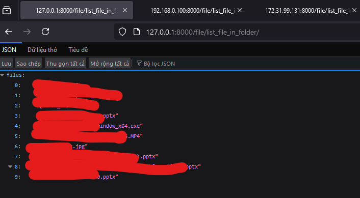

# Fast_API_server

# Hướng dẫn cách tạo API với FastAPI

# Mục lục

[I. FastAPI](#i-fastapi)
- [1. Cài đặt FastAPI](#1-cài-đặt-fastapi)
- [2. Khởi chạy FastAPI](#2-khởi-chạy-fastapi)

[II. Cách sử dụng](#ii-cách-sử-dụng)
- [1. Kết nối với CSDL (SQL Server)](#1-Kết-nối-với-CSDL-SQL-Server)
  - [1. Tạo chuỗi kết nối](#1-tạo-chuỗi-kết-nối)
  - [2. Tạo bảng dữ liệu](#2-tạo-bảng-dữ-liệu)
  - [3. Thêm sửa xóa dữ liệu trong CSDL ](#3-thêm-sửa-xóa-dữ-liệu-trong-CSDL)
  - [4. Chữ in đậm - Bold](#4-chữ-in-đậm---bold)
  - [5. In đậm và in nghiêng](#5-in-đậm-và-in-nghiêng)
  - [6. Chữ gạch giữa - Strikethrough](#6-chữ-gạch-giữa---strikethrough)
  - [7. Code trong dòng - Inline Code](#7-code-trong-dòng---inline-code)
- [2. Các khối](#2-các-khối)
  - [1. Trích dẫn - Blockquote](#1-trích-dẫn---blockquote)
  - [2. Danh sách có thứ tự - Ordered List](#2-danh-sách-có-thứ-tự---ordered-list)
  - [3. Danh sách không có thứ tự - Unordered List](#3-danh-sách-không-có-thứ-tự---unordered-list)
  - [4. Khối lệnh - Block Code](#4-khối-lệnh---block-code)
  - [5. Bảng - Table](#5-bảng---table)
- [3. Đặc biệt](#3-đặc-biệt)
  - [1. Đường kẻ ngang - Horizonal rules](#1-đường-kẻ-ngang---horizonal-rules)
  - [2. Liên kết - Link](#2-liên-kết---link)
  - [3. Hình ảnh - Image](#3-hình-ảnh---image)
  - [4. Biểu tượng cảm xúc - Icon](#4-biểu-tượng-cảm-xúc---icon)
  - [5. Checkbox](#5-checkbox)
  - [6. Escape markdown](#6-escape-markdown)

[III. Kết thúc](#iii-kết-thúc)

# I. FastAPI

## 1. Cài đặt FastAPI

Cài đặt `FastAPI` thông qua lệnh `pip` hoặc trực tiếp từ mã nguồn mở, xem chi tiết tại trang chủ [FastAPI](https://fastapi.tiangolo.com/):  

```python
pip install "fastapi[standard]"
```

## 2. Khởi chạy FastAPI

Để chạy `FastAPI` ta có thể sử dụng 2 câu lệnh thường xuyên như sau:  

```python
fastapi dev main.py
```


Câu lệnh này sẽ chạy `FastAPI` trên môi trường `Developer`, có nghĩa là môi trường test, khi bạn đang chạy `server (là khởi chạy fastapi)` và bạn thay đổi một số đoạn `code`, chỉnh sửa thêm một số file thì khi bạn lưu lại code nó sẽ tự động khởi động lại server, không cần ta phải chạy lại câu lệnh `fastapi dev main.py`.  

Và khi chạy lệnh này thì bạn chỉ có thể truy cập vào các địa chỉ có sẵn từ máy của bạn như:  
`http://127.0.0.1:8000/docs ` để xem toàn bộ api  
`http://127.0.0.1:8000/apixxx` truy cập api bạn tạo  

Và chỉ có duy nhất máy chủ có thể truy cập, các máy khác chưa thể truy cập được api này, vì vậy câu lệnh này chỉ chạy trên môi trường `dev`  

Cách thứ 2 ta có thể khởi động server là:  
```python
fastapi run main.py
```


Câu lệnh này sẽ lấy máy đang chạy làm máy chủ, và các máy tính khác trong cùng 1 dải mạng đều có thể truy cập api mà bạn tạo ra. Khi đó các máy khác sẽ truy cập được api của bạn thông qua địa chỉ:  

`http://IP:Port/apixxx`  
Trong đó `IP` sẽ là địa chỉ IP của máy tính đang làm server, port sẽ là: `8000` nếu bạn không cấu hình riêng, `apixxx` sẽ là địa chỉ api của bạn. Ví dụ:  
Để lấy địa chỉ ip của server thì bạn chạy lệnh sau trên CMD:
```
ipconfig
```


Ta có thể thấy được hai địa chỉ ip của máy tính như sau. Với `Ethernet: 192.168.0.100`, `Wifi: 172.31.99.131`, port thì mình không chỉnh sửa gì cả nên nó sẽ là `8000`, `apixxx: image/create_new_image`  
Như vậy ta có đường dẫn api cụ thể cho máy khác như sau:  
`http://192.168.0.100:8000/file/list_file_in_folder/` sẽ dành cho các máy tính kết nối với nhau thông qua `ethernet`.  

`http://172.31.99.131:8000/file/list_file_in_folder/` sẽ dành cho các máy tính kết nối cùng 1 mạng `wifi`.  



# II. Cách sử dụng

## 1. Kết nối với CSDL (SQL Server)

### 1. Tạo chuỗi kết nối

Để kết nối `FastAPI` với `SQL Server` thì ta cần thư viện: `sqlalchemy`, `pyodbc` và `driver ODBC`.  


Để cài đặt 2 thư viện trên ta sử dụng câu lệnh `pip`:  
```python
pip install SQLAlchemy
pip install pyodbc
```
Còn `drvier ODBC` ta lên trang chủ tải [Tại đây](https://learn.microsoft.com/en-us/sql/connect/odbc/download-odbc-driver-for-sql-server)  


Nhớ lưu ý phiên bản driver, như tôi đang sử dụng là `ODBC driver 18`.  

Để đảm bảo có thể kết nối đến được `SQL Server` thì trước tiên bạn phải kết nối được với nó bằng `tài khoản` bất kỳ, có thể là `sa` hay tên khác. Ví dụ như hình ảnh bên dưới.  


Sau khi đảm bảo được có thể kết nối tới `SQL Server` bằng tài khoản thì ta tạo cấu trúc kết nối bằng `Python` như sau:  

```python
# Lấy địa chỉ IP của máy chủ bằng socket
MY_HOSTNAME = socket.gethostname()
MY_IP_ADDR = socket.gethostbyname(MY_HOSTNAME)

# Cấu trúc chuỗi kết nối đến SQL Server
# pip install pyodbc
connection_url = URL.create(
    "mssql+pyodbc",
    username="sa", # Tên đăng nhập 
    password="123456789", # mật khẩu đăng nhập
    host=MY_IP_ADDR, #Địa chỉ IP của máy tính lấy được
    port=1433, # cổng kết nối khi mở kết nối SQL server, xem them wor video youtube của bản thân
    database="Smart_Parking_Server", # Tên của database cần truy cập
    query={
        "driver": "ODBC Driver 18 for SQL Server", # Phiên bản driver của ODBC đã tải về từ microsoft
        "TrustServerCertificate": "yes"  
    },
)

# Kết nối đến SQL Server
engine = create_engine(
    connection_url
)
```
Xem ví dụ cụ thể [tại đây](db/database.py)  

### 2. Tạo bảng dữ liệu  

Để tạo một bảng trong CSDL thì ta cần sử dụng lớp cha `Base = declarative_base()`, sau đó các bảng sẽ kế thừa lớp `Base` này. Trước tiên ta cần phải có cấu trúc của bảng mà ta cần tạo. Sau đó định nghĩa bảng đấy như sau:  

```python
class DbEmployee(Base):

    """
    Định nghĩa bảng nhân viên trong CSDL  
    - **tablename** là tên của bảng  
    - **id_code_employee*: Mã nhân viên  
    - **id_card**: Mã code phía sau thẻ nhân viên  
    - **username**: Họ tên nhân viên  
    - **avatar**: Ảnh đại diện của nhân viên
    - **vehicle**: Phương tiện di chuyển  
    - **email**: Email của nhân viên  
    - **phone_number**: SĐT của nhân viên  
    - **section**: Bộ phận của nhân viên  
    - **permission**: Quyền hạn  
    - **other**: các cột được bổ sung thông tin sau này  
    Bảng này sẽ được tạo nếu nó chưa tồn tại trong CSDL
    """
    __tablename__ = "employee"
    id_code_employee = Column(Integer, primary_key=True, unique=True)
    id_card = Column(Integer)
    id_vehicle = Column(Integer)
    username = Column(Unicode(100)) # Sử dụng kiểu Nvarchar
    avatar = Column(Unicode(100))
    email = Column(String(255), unique=True)
    phone_number = Column(String)
    section = Column(String)
    permission = Column(String)

    other1 = Column(String)
    other2 = Column(String)
    other3 = Column(String)
    other4 = Column(String)
    other5 = Column(String)
```
Chúng ta muốn tạo những bảng nào trong CSDL thì cần định nghĩa tất cả bảng. Một số kiểu dữ liệu nổi bật là:  

```python
from sqlalchemy import Unicode
from sqlalchemy import Column, Integer, String, DateTime
```
`Integer`: Số nguyên  
`String`: Chuỗi, thêm (255) sẽ là số ký tự tối đa  
`Unicode`: Chuỗi nhưng có dấu  
`DateTime`: ngày giờ  


Xem ví dụ cụ thể [tại đây](db/model.py)  

### 3. Thêm sửa xóa dữ liệu trong CSDL  

Sau khi có bảng dữ liệu trong `SQL Server` thì ta sẽ tiến hành `Thao tác` với những trường dữ liệu này. Đầu tiên ta cần định nghĩa các lược đồ của bảng dữ liệu trong `SQL Server`. Ví dụ với bảng `employee` mà tôi đã tạo trước đó. Để có thể thao tác với dữ liệu trong `SQL Server` thì ta cần lớp `BaseModel` từ thư viện `pydantic`.  

```python
class EmployeeBase(BaseModel):
    """
    Class này chứa thông tin cần được cung cấp để tạo một nhân viên mới
    - **id code**: Mã nhân viên  
    - **id card**: Mã thẻ từ của nhân viên  
    - **username**: Họ tên nhân viên  
    - **email**: Email của nhân viên  
    - **phone_number**: SĐT của nhân viên  
    - **section**: Bộ phận của nhân viên  
    - **permission**: Quyền hạn  
    - **other**: các cột được bổ sung thông tin sau này, khi nào thêm thông tin thì thêm vào  
    """
    id_code_employee: int
    id_card: int
    id_vehicle: int
    username: str
    email: str
    phone_number: str
    section: str
    permission: str
```
Class này sẽ chứa những thông tin mà ta cần người dùng cung cấp cho chúng ta, bạn có thể nhận thấy là nó đang thiếu 2 mục `avatar` và `other`.  

> Avatar là đường dẫn hình ảnh khi người dùng tải lên, việc người dùng vừa tải hình ảnh lên, vừa cung cấp các thông tin dạng json vào cùng 1 lúc sẽ gây ra lỗi khi gọi api. Vì vậy class này chỉ chứa các thông tin của người dùng, còn hình ảnh thì sau khi người dùng đã tạo hết thông tin thì sẽ có 1 api cho người dùng tải hình ảnh lên riêng. Vì vậy ở đây sẽ không có mục avatar.  
> Tương tự với other thì để dành cho sau này nên bây giờ nó chưa cần người dùng cung cấp thông tin nên sẽ không có vào.

Sau khi có thông tin từ người dùng, ta cũng cần phản hồi lại cho người dùng 1 thông tin. Ví dụ khi bạn cung cấp thông tin để tạo tài khoản, tạo xong thì sẽ có một thông báo trả về với nội dung: `Bạn đã tạo thành công tài khoản với tên người dùng: xxx`. Người dùng cung cấp rất nhiều thông tin, nhưng chúng ta trả về đơn giản chỉ là những thông tin cần thiết. Không nhất thiết phải trả về đầy đủ thông tin và những thông tin có tính cá nhân `(email, sđt, mật khẩu)` thì tuyệt đối không trả về bừa bãi.  
Vì vậy ta cũng tạo một class để hiển thị những thông tin trả về, và sau này chỉ cần gọi class này trong phản hồi thì nó sẽ tự động trả về những thông tin mà mình đã chỉ định:  

```python
class EmployeeDisplay(BaseModel):
    """
    Trả về thông tin người dùng theo ý muốn, không trả về những thông tin quan trọng như password đã hash
    Lưu ý tên của các trường thông tin trả về phải giống nhau, nếu không gặp lỗi
    - **id_code_employee**: Mã nhân viên  
    - **username**: Họ tên nhân viên  
    - **avatar**: Ảnh đại diện của nhân viên
    - **id_vehicle**: Phương tiện di chuyển  
    - **email**: Email của nhân viên  
    - **section**: Bộ phận của nhân viên  
    -  **Config**: cho phép tự động chuyển đổi dữ liệu type: Database quay trở về kiểu mà ta đã khai báo (str)
    """
    id_code_employee: int
    username: str
    avatar: str
    email:str
    section: str
    id_vehicle: int
    class Config():
        from_attributes  = True
```
##
Ta cần khai báo `Config` để khi ta lấy thông tin từ `SQL Server` trả về dưới dạng `string`, `int` không gặp lỗi. Nếu không sẽ gặp xung đột khi cố gắng chuyển đổi kiểu dữ liệu của `Database` sang kiểu dữ liệu `python`.  
##

Tương tự với các bảng còn lại, ta cần người dùng cung cấp thông tin gì thì sử dụng `class tableBase`, và sẽ hiển thị những thông tin gì khi có người gọi api thì sử dụng `class tableDisplay`.  

Xem ví dụ cụ thể [tại đây](schemas/schemas.py)  

##  
Tất cả các công việc liên quan với `Database` trong `FastAPI` thì ta sẽ sử dụng thư viện `sqlachemy` để thao tác.  
Với việc thêm 1 trường dữ liệu vào bảng trong `SQL Server` ta làm như sau:  

```python
def create_employee(db: Session, request: EmployeeBase, avatar_path: str = "Not upload"):
    """
    Tạo thông tin nhân viên mới vào cơ sở dữ liệu  
    Các thông tin yêu cầu người dùng cung cấp phải đầy đủ như đã khai báo ở `DbEmployee`
    
    """
    
    new_employee = DbEmployee(
        id_code_employee = request.id_code_employee,
        id_card = request.id_card,
        id_vehicle = request.id_vehicle,
        username = request.username,
        avatar = avatar_path,
        email = request.email,
        phone_number=request.phone_number,
        section = request.section,
        permission = request.permission,
        other1 = "Not use",
        other2 = "Not use",
        other3 = "Not use",
        other4 = "Not use",
        other5 = "Not use",
    )

    try:
        db.add(new_employee)
        db.commit()
        db.refresh(new_employee)
    except exc.SQLAlchemyError as e:
        db.rollback()
        raise HTTPException(
            status_code= status.HTTP_400_BAD_REQUEST,
            detail= f"Thêm nhân viên mới không thành công, lỗi: {e}"
        )
    return new_employee
```

Khi ta tạo một đối tượng `new_employee` thì ta cần phải cung cấp đầy đủ thông tin mà bảng đó cần. Với bảng `employee` thì ta cần các trường: `id_code_employee`, `id_card`, `id_vehicle`, `username`, `avatar`, `email`, `phone_number`, `section`, `permission`, `other1-5`. Vì vậy đối tượng `new_employee` sẽ phải đầy đủ những thông tin đó.  
Các thông tin này sẽ được lấy từ biến `request` là đối tượng thuộc class `EmployeeBase`. Hai trường `avatar` và `other` mình điền là các chuỗi string mặc định. Bởi vì trong class `EmployeeBase` mình không khai báo 2 trường này nên `request` không có 2 thuộc tính này để truy cập.  
Ta có thể thêm thời gian bằng thư viện `datetime` như sau: `time_in = datetime.datetime.now()`  
Sau khi tạo một đối tượng mới cho bảng `employee` thì ta sẽ thêm nó vào DB thông qua `db:session` là một phiên kết nối tới `SQL Server` bằng câu lệnh:  

```python
try:
        db.add(new_employee)
        db.commit()
        db.refresh(new_employee)
except exc.SQLAlchemyError as e:
    db.rollback()
    print(e)

    raise HTTPException(
        status_code= status.HTTP_400_BAD_REQUEST,
        detail= "Thêm nhân viên mới không thành công"
    )
```

Sau khi sử dụng câu lệnh `add` thì phải `commit` để lúc đấy mới chính thức đưa dữ liệu lên DB, và chúng ta `refresf(new_employy)` để cập nhật lại các giá trị index. Việc thêm sửa xóa dữ liệu ở DB có nguy cơ lỗi rất cao nên chúng ta phải sử dụng `try-except` để đảm bảo nếu trong quá trình ghi dữ liệu lỗi thì có thể `rollback` lại để quay trở lại trước khi xảy ra lỗi. Và sau đó dưa ra một `Exception` kèm theo `mã code lỗi` và chi tiết lỗi. Như vậy khi gọi api mà ta nhận mã code `200` là thêm dữ liệu thành công, được mã lỗi `400` là ta biết được rằng trong quá trình thêm dữ liệu bị lỗi và đã `rollback`, còn các mã lỗi khác thì có thể gặp vấn đề với kết nối với server. Việc này giúp ta nắm rõ hơn các trường hợp xảy ra khi gọi api.  

Sau khi có hàm tạo nhân viên thì ta sẽ tiến hành tạo một api gọi đến hàm này.  

```python
from fastapi import APIRouter, Depends
from sqlalchemy.orm.session import Session
from schemas.schemas import EmployeeDisplay, EmployeeBase
from db.database import get_db
from db import db_employee

router = APIRouter(
    prefix="/employee",
    tags=["employee"]
)

# Tạo thông tin nhân viên vào CSDL
@router.post("/create_employee",response_model= EmployeeDisplay)
def create_user(request: EmployeeBase, db: Session = Depends(get_db)): # avatar: UploadFile = File(...): không thể vừa tải lên Json vừa uploadfile
    """
    Tạo thông tin nhân viên vào CSDL, việc tạo thông tin và cập nhật hình ảnh không thể thực hiện cùng lúc  

    """
    avatar_path = "None"
    
    return db_employee.create_employee(db= db, request= request, avatar_path = avatar_path)
```
File này sẽ chứa tất cả các api mà có liên quan đến bảng `Employee` trong CSDL.  

```python
router = APIRouter(
    prefix="/employee",
    tags=["employee"]
)
```
Tạo `router` với các thông tin ban đầu như trên. Vì vậy với mỗi api ở đây đều từ động thêm tiền tố `/employee` trước đường dẫn api. Ví dụ nếu ta tạo api với đường dẫn `/get_employee` thì nó sẽ trở thành `http://IP:Port/employee/get_employee`.  
Để tạo 1 api trong `FastAPI` thì cần khai báo phương thức truy cập của api đầu tiên. Theo chuẩn REST thì như bên dưới, đây là 1 chuẩn khá thông dụng, bạn không theo tiêu chuẩn này cũng không sao:  

> GET: Là api cho phép truy cập lên server và lấy dữ liệu về. Ví dụ gọi api lấy thông tin nhân viên, lấy thông tin mật khẩu người dùng, ...  
> POST: Là đưa dữ liệu mới lên server. Ví dụ như tạo thông tin cho nhân viên mới, tạo thông tin đăng nhập mới, ...  
> PUT: Là sửa, cập nhật dữ liệu trên server. Ví dụ như cập nhật dữ liệu người dùng, ...  
> DELETE: Xóa một dữ liệu trên server.  


### Chỉ có phương thức GET là có thể truy cập được bằng đường link dán trực tiếp lên trình duyệt  

Ta tạo 1 api để tạo dữ liệu cho 1 nhân viên mới nên sẽ dùng `POST`:  `@router.post("/create_employee",response_model= EmployeeDisplay)`  
api này sẽ có đường dẫn `http://IP:port/employee/create_employee`, và kết quả trả về khi gọi api này sẽ theo định dạng class `EmployeeDisplay` mà ta đã khai báo [ở đây](schemas/schemas.py).  

Các thông tin cần cung cấp cho api này là `EmployeeBase`, class chứa thông tin mà người dùng cung cấp, `db: Session = Depends(get_db)` sẽ tạo kết nối đến với CSDL  

Vậy là ta đã có 1 api tạo thông tin nhân viên lên CSDL. Để api này hoạt động thì ta sẽ thêm nó vào api chính. Ta tạo file `main.py` sẽ chứa tất cả các api con.  

```python
from fastapi import FastAPI # pip install "fastapi[standard]"
import uvicorn
from db.database import engine
from db import model
from router import employee_router

app = FastAPI(
    docs_url="/myapi",  # Đặt đường dẫn Swagger UI thành "/myapi"
    redoc_url=None  # Tắt Redoc UI
)

app.include_router(employee_router.router)

# Tạo Bảng trong DB nếu nó chưa tồn tại
model.Base.metadata.create_all(engine)


if __name__ == "__main__":
    # Chạy file này bằng cách `python service\main.py`
    # sẽ lấy máy chạy file này làm máy chủ, các máy tính cùng dải mạng đều có thể truy cập API này
    uvicorn.run(app, host="0.0.0.0", port=8000)

    # Hoặc gõ trực tiếp lệnh `fastapi dev main.py` để vào chế độ developer
    # Hoặc gõ trực tiếp lệnh `fastapi run main.py` để vào chế độ lấy máy chạy làm server

```

Ta sẽ khởi tạo `FastAPI` với tên gọi `app` để khi chạy thì `FastAPI` tự tìm thấy nó và khởi chạy.  

```python
app = FastAPI(
    docs_url="/myapi",  # Đặt đường dẫn Swagger UI thành "/myapi"
    redoc_url=None  # Tắt Redoc UI
)
```
Ta có thể tùy chỉnh đường dẫn `docs` mặc định thành đường dẫn mà ta mong muốn. Để thêm các `api router` thì ta phải dùng lệnh `include_router`, khi đó các api nằm trong router này sẽ được thêm. Nếu không `include_router` thì nó sẽ không chạy.  

```python
app.include_router(employee_router.router)
```


```python
# Tạo Bảng trong DB nếu nó chưa tồn tại
model.Base.metadata.create_all(engine)
```
Câu lệnh trên sẽ tự động kiểm tra bảng CSDL trên server đã có chưa, nếu chưa thì nó sẽ tự động tạo, nếu có rồi thì nó sẽ bỏ qua.  
